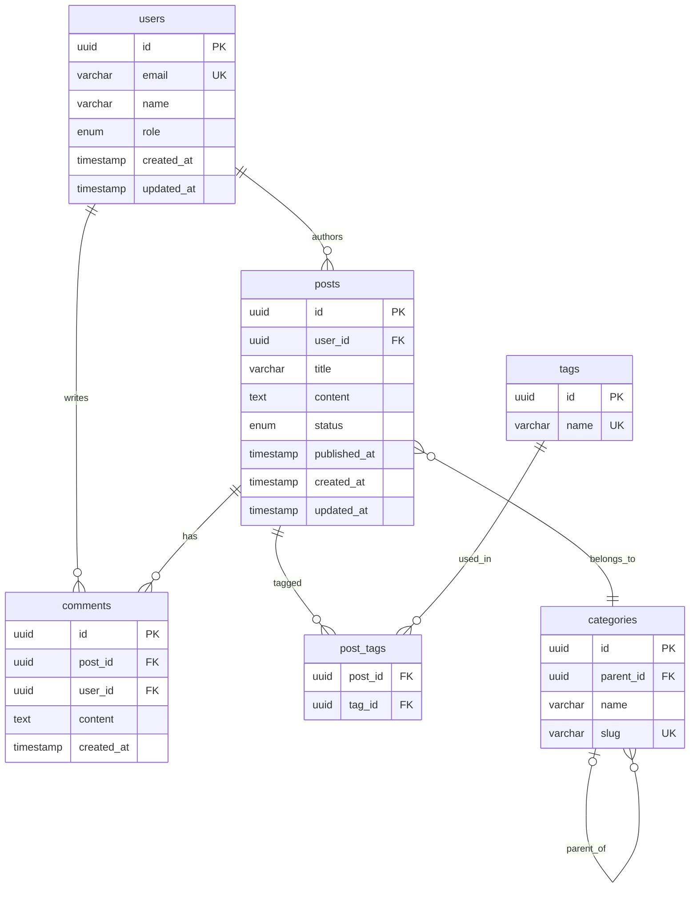
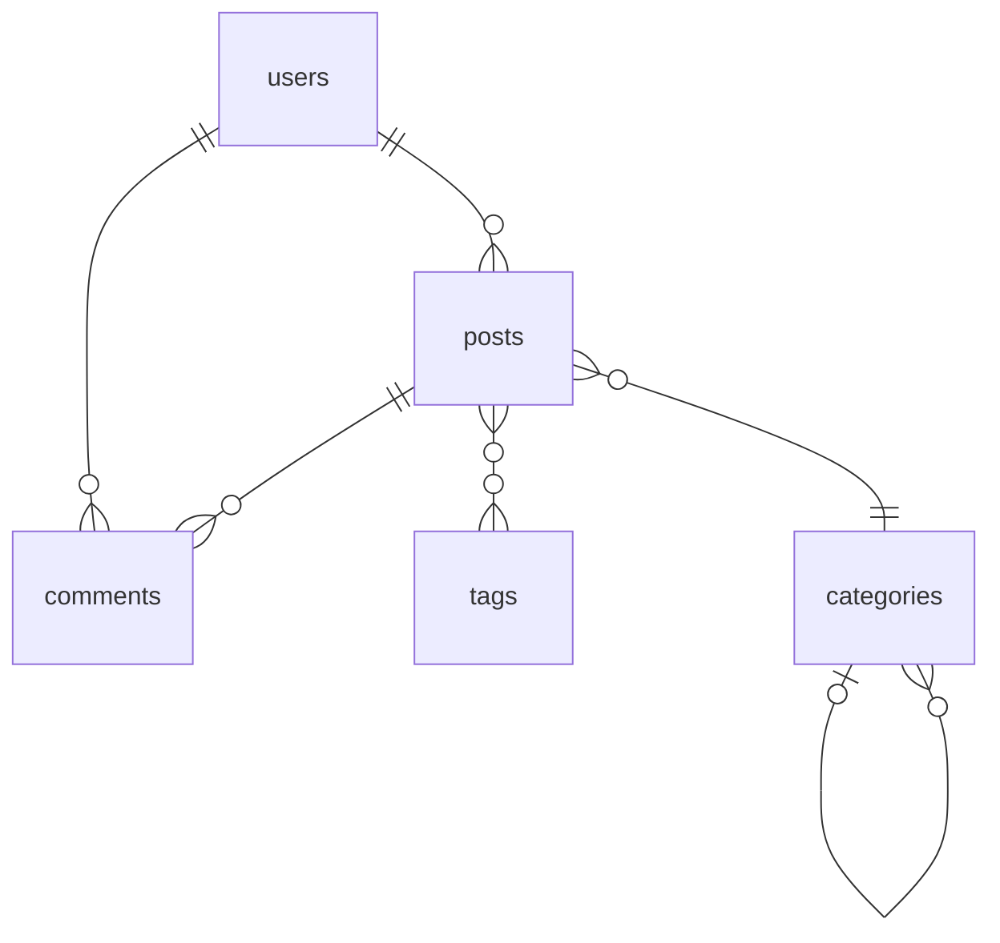
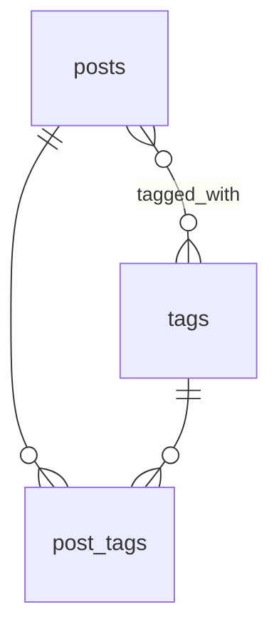
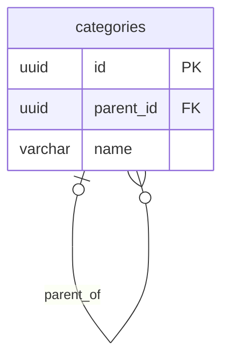

# Mermaid ER Diagram Template

Use this template to generate visual entity-relationship diagrams from database schemas.

## Structure

```mermaid
erDiagram
    [TABLE_NAME] {
        [type] [column_name] [PK,FK,UK]
    }

    [PARENT_TABLE] ||--o{ [CHILD_TABLE] : "[relationship_label]"
```

## Relationship Notation

| Notation | Meaning |
|----------|---------|
| `\|\|` | Exactly one |
| `o\|` | Zero or one |
| `}o` | Zero or more |
| `}\|` | One or more |

### Common Patterns

```
||--o{    One-to-many (required parent)
|o--o{    One-to-many (optional parent)
||--||    One-to-one (both required)
|o--o|    One-to-one (both optional)
}o--o{    Many-to-many (via junction table)
```

## Column Key Annotations

- `PK` - Primary Key
- `FK` - Foreign Key
- `UK` - Unique Key

## Example Output



## Rendering Notes

1. **GitHub**: Mermaid diagrams render natively in markdown files
2. **VS Code**: Use "Markdown Preview Mermaid Support" extension
3. **Online**: Use [mermaid.live](https://mermaid.live) for interactive editing

## Simplified Version (Large Schemas)

For large databases, create a simplified overview:



## Generating from Schema Data

```typescript
function generateMermaid(tables: TableSchema[], foreignKeys: ForeignKey[]): string {
  let diagram = 'erDiagram\n';

  // Generate entities
  for (const table of tables) {
    diagram += `    ${table.name} {\n`;
    for (const col of table.columns) {
      const keys = [];
      if (col.isPrimaryKey) keys.push('PK');
      if (col.isForeignKey) keys.push('FK');
      if (col.isUnique) keys.push('UK');
      const keyStr = keys.length ? ` ${keys.join(',')}` : '';
      diagram += `        ${col.type} ${col.name}${keyStr}\n`;
    }
    diagram += `    }\n\n`;
  }

  // Generate relationships
  for (const fk of foreignKeys) {
    diagram += `    ${fk.referencedTable} ||--o{ ${fk.table} : ""\n`;
  }

  return diagram;
}
```

## Handling Many-to-Many

Many-to-many relationships through junction tables:



## Self-Referential Relationships

For hierarchical data (e.g., categories with parent):


